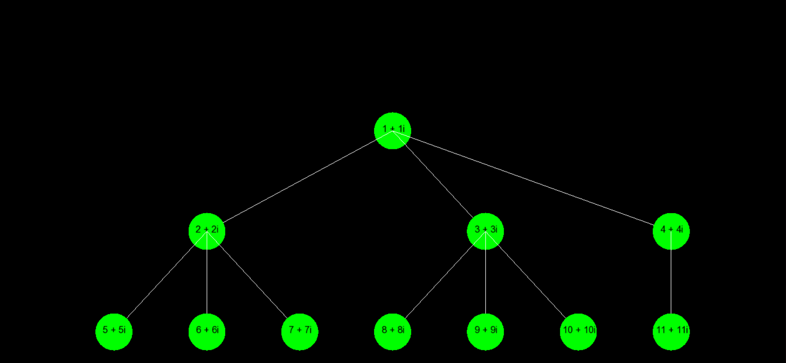

# Tree.hpp ReadMe

## Overview

The `Tree` class template in `Tree.hpp` provides an implementation of a generic tree data structure that can hold nodes of any type `T`. The template parameter `N` specifies the maximum number of children a node can have (default is 2). The tree supports various traversal methods and includes visualization capabilities using the SFML graphics library.

## Files and Dependencies

- **Tree.hpp**: Contains the `Tree` class template and its implementation.
- **Node.hpp**: Contains the `Node` class template which is used by the `Tree` class.
- **InOrderIterator.hpp**: Contains the in-order traversal iterator.
- **TreeIterator.hpp**: Base class for all tree iterators.
- **PreOrderIterator.hpp**: Contains the pre-order traversal iterator.
- **PostOrderIterator.hpp**: Contains the post-order traversal iterator.
- **BFSIterator.hpp**: Contains the breadth-first traversal iterator.
- **DFSIterator.hpp**: Contains the depth-first traversal iterator.
- **HeapIterator.hpp**: Contains the heap traversal iterator.
- **SFML/Graphics.hpp**: SFML library used for tree visualization.

## Usage

### Creating a Tree

To create a tree, instantiate the `Tree` class template with the desired node type and maximum number of children:

```cpp
Tree<int, 3> myTree;
```

### Adding Nodes

To add a root node or a child node:

```cpp
Node<int>* rootNode = new Node<int>(value);
myTree.add_root(rootNode);

Node<int>* childNode = new Node<int>(childValue);
myTree.add_sub_node(rootNode, childNode);
```

### Traversing the Tree

You can traverse the tree using different iterators:

```cpp
// Pre-order traversal
for (auto it = myTree.begin_pre_order(); it != myTree.end_pre_order(); ++it) {
    cout << **it << " ";
}

// In-order traversal
for (auto it = myTree.begin_in_order(); it != myTree.end_in_order(); ++it) {
    cout << **it << " ";
}

// Post-order traversal
for (auto it = myTree.begin_post_order(); it != myTree.end_post_order(); ++it) {
    cout << **it << " ";
}

// Breadth-first traversal
for (auto it = myTree.begin_bfs_scan(); it != myTree.end_bfs_scan(); ++it) {
    cout << **it << " ";
}

// Depth-first traversal
for (auto it = myTree.begin_dfs_scan(); it != myTree.end_dfs_scan(); ++it) {
    cout << **it << " ";
}
```

### Visualizing the Tree

The `Tree` class includes methods to visualize the tree using the SFML graphics library. To visualize the tree:

```cpp
Tree<int, 3> myTree;
// ... add nodes to the tree ...

sf::Font font;
if (!font.loadFromFile("/usr/share/fonts/truetype/msttcorefonts/arial.ttf")) {
    std::cerr << "Error loading font" << std::endl;
    return -1;
}

sf::RenderWindow window(sf::VideoMode(800, 600), "Tree Visualization");
while (window.isOpen()) {
    sf::Event event;
    while (window.pollEvent(event)) {
        if (event.type == sf::Event::Closed)
            window.close();
    }

    window.clear();
    myTree.draw(window, font);
    window.display();
}
```

### Outputting the Tree to an `ostream`

You can output the tree to an `ostream` to visualize it in a window:

```cpp
std::cout << myTree;
```

## Example for a cout


### Tree Properties

- **get_root()**: Returns the root node of the tree.
- **getNumberOfNodes()**: Returns the number of nodes in the tree.
- **calculateTreeDepth(Node<T>* node)**: Calculates the depth of the tree.
- **calculateMaxWidthAtLevel(Node<T>* node, int level)**: Calculates the maximum width at a given level of the tree.
- **calculateSubtreeWidth(Node<T>* node, float horizontalSpacing)**: Calculates the width of a subtree.
- **calculateNodePositions(...)**: Calculates the positions of nodes for visualization.
- **drawNode(...)**: Draws a single node and its connections.
- **draw(...)**: Draws the entire tree.

## Installation

Ensure you have SFML installed on your system. For example, on Ubuntu:

```sh
sudo apt-get install libsfml-dev
```